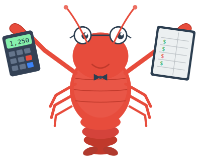

<p align="center">
  
</p>

<h1 align="center">ClawCounting</h1>

<p align="center">Foundational double-entry bookkeeping engine for AI agents. Single binary + single SQLite database.</p>

> [!WARNING]
> This software is under active development and is not suitable for production use at this time.

Provides the accounting primitives -- currencies, accounts, journal entries, periods, balances, reports -- that AI agents and other systems use to build domain-specific workflows.

## Features

- **Double-entry accounting** -- every journal entry must balance (total debits == total credits), with minimum 2 lines, all in the same currency
- **Immutable journal** -- journal entries are append-only; corrections via reversing entries only
- **Financial periods** -- fiscal year management with permanent close, automatic closing entries (revenue/expense zeroing into retained earnings)
- **Subledger support** -- control accounts with per-entity sub-accounts (AR/AP by customer/vendor)
- **Multi-currency** -- fiat and crypto with full wei-precision
- **Two interfaces** -- REST API (for agents and web UI) and CLI (for scripts, cron, admin) sharing the same service layer
- **Built-in web UI** -- self-hosted dashboard embedded in the binary
- **OpenAPI docs** -- auto-generated spec with Swagger UI at `/swagger-ui`
- **Agent Skill** -- [agentskills.io](https://agentskills.io) standard skill for teaching AI agents accounting workflows
- **Zero deployment overhead** -- no external database servers, no runtime dependencies

## Quick Start

### Docker

```bash
docker pull ghcr.io/johnkozan/clawcounting:latest

# Initialize the database
docker run -v clawcounting-data:/data ghcr.io/johnkozan/clawcounting init

# Start the server
docker run -p 3000:3000 -v clawcounting-data:/data ghcr.io/johnkozan/clawcounting serve
```

### Build from Source

**Prerequisites:** [Rust](https://rustup.rs/) (edition 2024), [pnpm](https://pnpm.io/)

```bash
git clone https://github.com/johnkozan/clawcounting.git
cd clawcounting
cargo install --path .

clawcounting init
clawcounting serve
```

The server starts at `http://localhost:3000`. On first run, you'll be guided through setup (creating your first user) via the web UI.

For full documentation, see the [ClawCounting Docs](https://johnkozan.github.io/clawcounting/docs/).

## Agent Skill

ClawCounting includes an [Agent Skill](https://agentskills.io) in `skill/SKILL.md` that teaches AI agents how to use the accounting engine -- domain rules, workflows, and best practices. Supported by Claude Code, Cursor, VS Code/Copilot, and other agent platforms.

## License

MIT -- see [LICENSE](LICENSE) for details.
